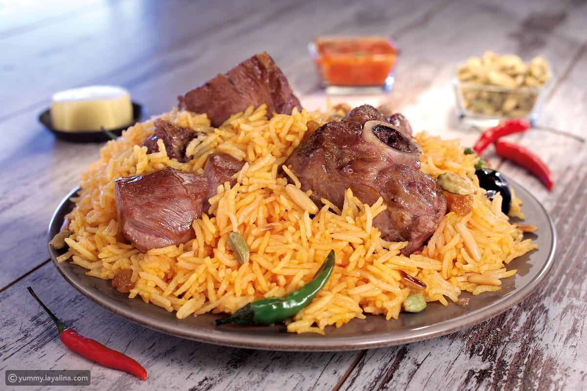
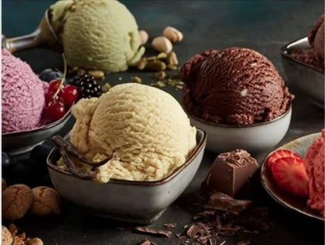
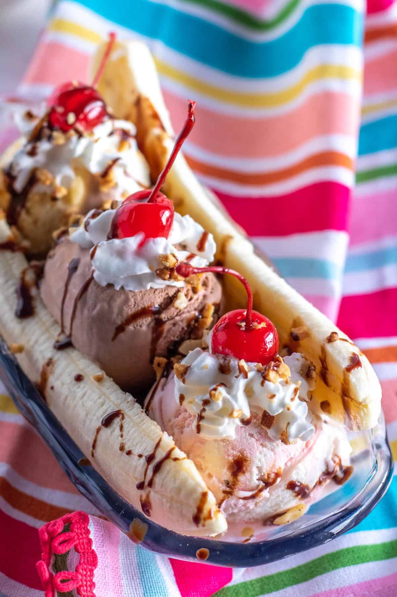

# my-restaurant

# Welcome **NAJM** Restaurant

**The most delicious dishes in one place**

### **Appetiers :**

| Dishes names       |      Price (jod) |      |
| :---               |    :----:   |          ---: |
| Yalanji             | 1.85       |  
| Hummus   | 1.5     |     
| kobbeh (piece)     | 0.6       |  
| Salad            | 1.50      |  
| French fries   | 1.50    |     
| Lentil soup    | 1.50      |  

### **Main Dishes :**
| Dishes names       |      Price (jod) |      |
| :---               |    :----:   |          ---: |
| Shawerma :   
| - Regular         |      2.00    
| - Super   | 3    |    
| - Doubl    |3.90 |
| Mansaf (250 gm Meat) | 5.50     |      
| kabsa (250 gm Meat)  | 5.50       |      
|Roast Chicken   | 6.00      |      

### **Drinks :**

  | dishes names       |      price (jod) |      |
| :---               |    :----:   |          ---: |
| Pepsi           |0.5  | 
| Tea | 1.00     |      
| Turkish Coffee | 1.25      |      
| Fresh Juice :    
| - Orange           |2.20  
| - Lemon with mint  | 2.50        

### **Sweets :**

| Dishes names       |      Price (jod) |      |
| :---               |    :----:   |          ---: |
| Ice-cream            |1.00  | 
| Banana split | 3.50     |  
| Konafa 
|- Na'ameh OR khishneh 250 g |1.50     |  
| -Warbat        250g       |  1.25       |

_Thank you for coming to our restaurant_

##### This task has been done by Walaa Atiyh [click here!](https://github.com/WalaaAtiah)

